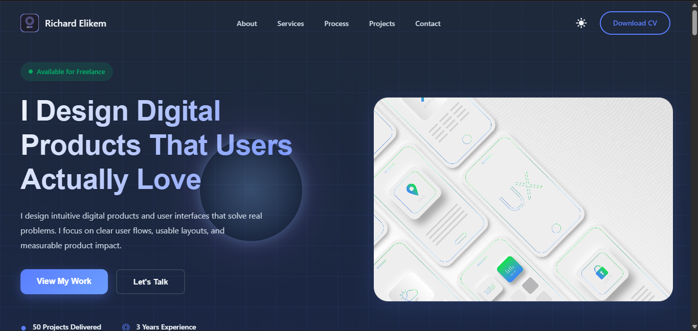

# Richard Elikem Portfolio


Modern, responsive portfolio website for Richard Elikem, Product Designer.

---

## ✨ Features

- 🌗 Light & dark mode with smooth toggle
- 🖱️ Animated mouse-following glow effect
- 📬 Responsive contact form (Formspree integration)
- 📱 Mobile-first, accessible, and modern design
- 🦶 Fully responsive footer and navigation

---

## 🚀 Getting Started

### Local Development
1. **Clone or download** this repository.
2. **Open** the folder in your favorite IDE (e.g., VSCode).
3. **Open** `index.html` in your browser to view the site locally.

### Editing
- All main styles: [`css/styles.css`](css/styles.css)
- Main HTML: [`index.html`](index.html)
- Assets (images, icons): [`assets/`](assets/)

---

## 🌍 Deploying to Vercel

1. [Sign up for Vercel](https://vercel.com/) if you don't have an account.
2. Click **New Project** and import your GitHub repository (or drag and drop the folder if not using git).
3. Vercel will auto-detect this as a static site. No build step is needed.
4. Click **Deploy**. Your site will be live on a Vercel URL (e.g., `https://your-portfolio.vercel.app`).
5. (Optional) Set up a custom domain in Vercel dashboard.

---

## 📧 Setting up the Contact Form

This template uses [Formspree](https://formspree.io/) for the contact form to collect real data from visitors.

### Step-by-Step Setup:

1. **Create a Formspree Account**
   - Go to [Formspree.io](https://formspree.io/) and sign up with your email
   - Verify your email address

2. **Create a New Form**
   - Click "New Form" in your Formspree dashboard
   - Enter your email address (where you want form submissions sent)
   - Accept the confirmation email from Formspree
   - Copy your form endpoint ID (e.g., `f/abc123xyz`)

3. **Update the Form in Your Portfolio**
   - Open `index.html` in your text editor
   - Find the contact form section (around line 528):
   ```html
   <form class="contact-form" action="https://formspree.io/f/your-form-id" method="POST">
   ```
   - Replace `your-form-id` with your actual form ID from Formspree
   - Example: `https://formspree.io/f/xyzqwerty`

4. **Test the Form**
   - Open your portfolio locally or on Vercel
   - Fill out the contact form and submit
   - Check your email for the submission
   - Formspree will also log all submissions in your dashboard

5. **Configure Email Notifications (Optional)**
   - In your Formspree dashboard, set up email forwarding
   - Receive submissions to your preferred email address
   - Set up auto-responses to thank visitors who submit

### Form Fields Collected:
- **Name** - Visitor's full name
- **Email** - Visitor's email address (for you to reply)
- **Service Needed** - Dropdown selection of services (UI/UX Design, Product Design, Dashboard Design, Technical Support, IT Support, Customer Service, Other)
- **Project Details** - Text description (max 500 characters)

All submissions are timestamped and stored securely on Formspree's servers.

---

## 🖼️ Screenshots

<p align="center">
  
</p>

---

## 🛠️ Customization
- Update your name, description, and social links in [`index.html`](index.html).
- Replace images in the [`assets/`](assets/) folder as needed.
- Adjust theme colors in [`css/styles.css`](css/styles.css) under the `:root` selector.

---

## 📄 License
This project is open source and free to use for personal portfolio purposes.